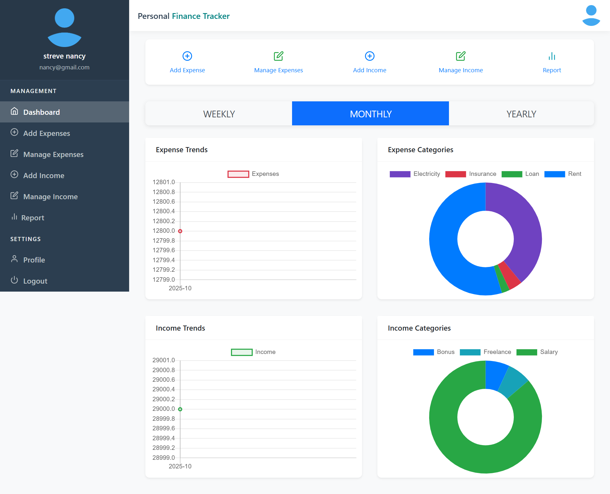
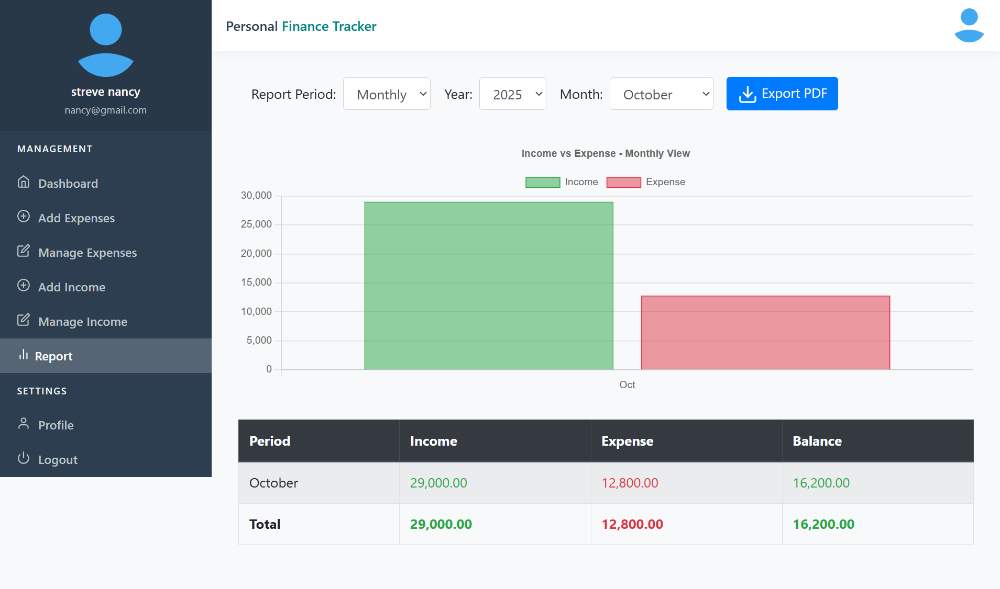

#  Personal Finance Tracker

A **web-based personal finance tracker** that helps users manage their income and expenses, track financial history, and generate insightful reports.  
Built with **HTML, CSS, JavaScript (Frontend)** and **PHP with MySQL (Backend)**.

---

##  Features
**User Authentication**  
  - Register, Login, and Forgot Password functionality.
  
**Dashboard**  
  - Personalized user dashboard with financial overview.
  
**Add Income & Expenses**  
  - Record and categorize transactions.
  
**Reports**  
  - View reports by:
    - Daily
    - Monthly
    - Yearly
  - Includes flowcharts/graphs for better financial insights.
  
---

##  Tech Stack
- **Frontend**: HTML, CSS, JavaScript  
- **Backend**: PHP  
- **Database**: MySQL  
- **Server**: XAMPP (for local development)  

---
  
   
   
## ⚙️ Installation & Setup
1. Clone the repository:
   ```bash
   git clone https://github.com/yourusername/personal_finance_tracker.git
   
